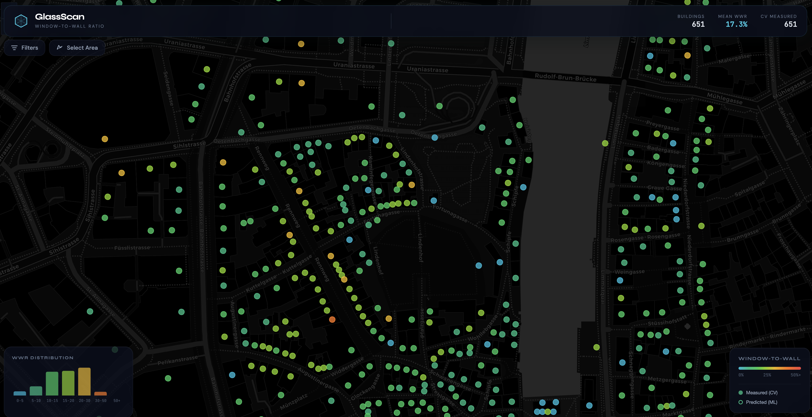
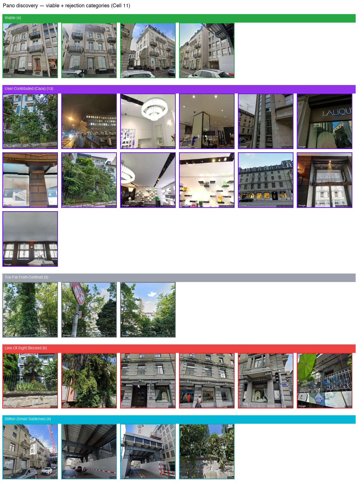
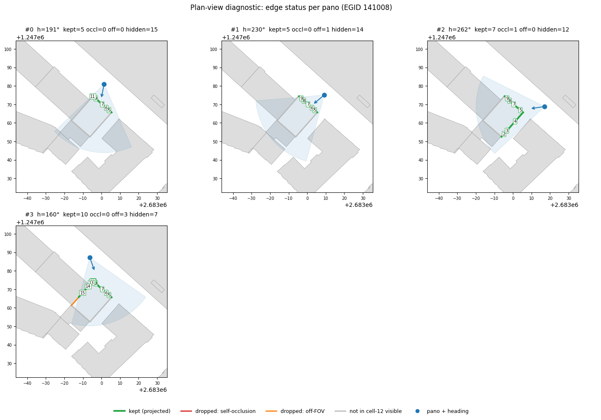
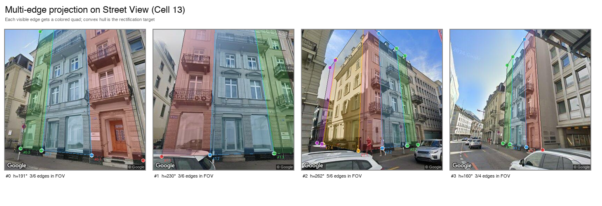
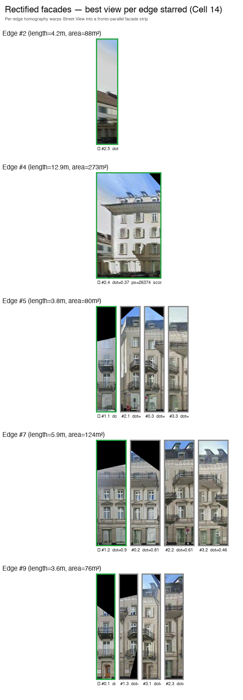
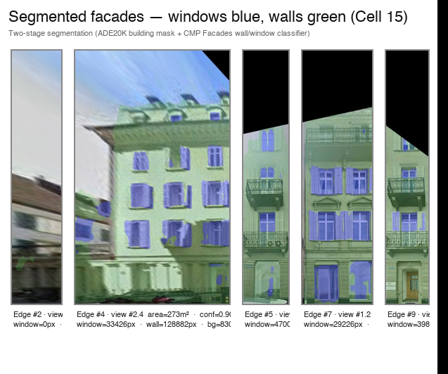

# GlassScan

**Window-to-wall ratio estimation for Swiss buildings, from Google Street View imagery and 3D footprints.**

GlassScan measures how much of a building's facade is glazed. The window-to-wall ratio (WWR) is a key parameter in building-stock energy models and a strong driver of retrofit economics, but no central register of it exists. GlassScan estimates it from Google Street View by reasoning about the building's 3D geometry first, planning which panoramas can see each facade, mapping each facade into image space via a calibrated pinhole camera, rectifying it via a homography fit to known 3D corners, and only then performing pixel-level segmentation. Per-facade ratios are aggregated to the building level with a weighting scheme that accounts for both view quality and physical facade area.



The dashboard above shows 651 buildings around Zurich Lindenhof, mean WWR 17.3%, colour-coded from green (low) to red (high).

## Pipeline

```
              Swiss Federal Building Register (GWR)            Google Street View Static API
                              │                                          │
                              ▼                                          ▼
        swissBUILDINGS3D footprint + height              Panoramas within 50 m
                              │                                          │
                              └──────────────┬───────────────────────────┘
                                             ▼
        1. Edge decomposition   2. Pano discovery (BFS)   3. Visibility test (dot product)
                                             │
                                             ▼
        4. 3D → image projection  →  5. Per-edge homography  →  6. Two-stage segmentation
                                             │
                                             ▼
                       7. Score × area-weighted aggregation
                                             │
                                             ▼
                       Per-building WWR with calibrated weights
```

The reference implementation is `notebooks/geometry_single_building.ipynb`, which runs the full pipeline on a single EGID and writes diagnostic maps and per-stage figures. The mathematics below tracks that notebook cell by cell.

## Methodology

### Data sources

- **swissBUILDINGS3D 3.0** (swisstopo). National 3D building dataset. We use the 2D `Floor` layer for footprints and `GESAMTHOEHE` for total building height. Distributed as ESRI File Geodatabase tiles via the swisstopo STAC API.
- **GWR** (Federal Register of Buildings and Dwellings). Maps an EGID (Swiss building ID) to coordinates, year of construction, storey count, heating type, gross floor area. For non-EGID cantons (e.g. Vaud), a spatial point-in-polygon join recovers the same link.
- **Google Street View Static API**. Panorama metadata is free; image fetches cost ~$7 per 1000 calls and are billed against the $200 monthly Maps credit.

### 0. Coordinate systems

All geometry is performed in the Swiss LV95 frame (EPSG:2056), an oblique conformal Mercator projection of the Bessel 1841 ellipsoid centred on Bern. LV95 is locally Cartesian with axes in metres ($x$ East, $y$ North), so dot products, shoelace areas, and metric distance caps mean what they look like. WGS84 inputs (Street View pano coordinates, GWR points) are reprojected via pyproj's seven-parameter Helmert transformation,

$$\begin{pmatrix} X \\ Y \\ Z \end{pmatrix}_{\text{LV95}} = \begin{pmatrix} t_x \\ t_y \\ t_z \end{pmatrix} + (1+s) \, R_x(\omega_x) R_y(\omega_y) R_z(\omega_z) \begin{pmatrix} X \\ Y \\ Z \end{pmatrix}_{\text{WGS84}},$$

with the CHENyx06 datum-shift parameters. The geocentric coordinates are then projected to LV95 via the swisstopo Hayford-projection equations. Doing all geometry directly in WGS84 would corrupt every angular and metric test.

### 1. Footprint orientation and edge decomposition

A building footprint is a closed polygon with vertices $\{(x_i, y_i)\}_{i=0}^{n-1}$ in LV95. We need a consistent winding so that the outward normal of each edge points away from the interior. The signed area (Shoelace formula) determines orientation:

$$2A_{\text{signed}} = \sum_{i=0}^{n-1} \big(x_i \, y_{i+1} - x_{i+1} \, y_i\big), \qquad \text{the polygon is CCW} \iff A_{\text{signed}} > 0.$$

We re-orient to CCW via shapely's `orient(...)`. For a CCW edge from $\vec{p}_1 = (x_1, y_1)$ to $\vec{p}_2 = (x_2, y_2)$, the unit tangent is

$$\hat{t} = \frac{\vec{p}_2 - \vec{p}_1}{\ell}, \qquad \ell = \|\vec{p}_2 - \vec{p}_1\|_2.$$

The outward unit normal is the tangent rotated 90° clockwise. The 2D rotation matrix by angle $-\pi/2$ is

$$R_{-\pi/2} = \begin{pmatrix} \cos(-\pi/2) & -\sin(-\pi/2) \\ \sin(-\pi/2) & \cos(-\pi/2) \end{pmatrix} = \begin{pmatrix} 0 & 1 \\ -1 & 0 \end{pmatrix},$$

so for $\hat{t} = (\hat{t}_x, \hat{t}_y)$,

$$\vec{n} = R_{-\pi/2} \, \hat{t} = (\hat{t}_y, \; -\hat{t}_x).$$

This is outward only when the polygon is CCW; for a CW polygon the same formula yields the inward normal, which is exactly why we re-oriented first. The compass bearing of $\vec{n}$ (0° North, 90° East) is

$$\beta = \big(\text{atan2}(n_x, \; n_y) \cdot 180/\pi + 360\big) \bmod 360.$$

Edges shorter than 3 m are dropped (chamfered corners, party walls, irrelevant detail). Each remaining edge becomes a candidate facade carrying $(\vec{p}_1, \vec{p}_2, \vec{m}, \vec{n}, \ell, \beta)$, where $\vec{m} = \tfrac{1}{2}(\vec{p}_1 + \vec{p}_2)$ is the midpoint.

→ **[Interactive: footprint with edges and outward normals](https://raw.githack.com/LykourgosM/glassscan/main/data/geometry_single_building_edges.html)**

### 2. Panorama discovery via BFS

Naive nearest-pano lookup picks one camera, often pointing the wrong way. We instead enumerate the set of viable panoramas in two phases.

**Seed phase.** For each major edge, probe at perpendicular offsets $d \in \{12, 25, 40\}$ m from the midpoint along the outward normal:

$$\vec{p}_d^{(\text{seed})} = \vec{m} + d \cdot \vec{n}.$$

The free metadata endpoint at each $\vec{p}_d^{(\text{seed})}$ returns the actually-existing nearest pano, which becomes a BFS root.

**Expansion phase.** From each seed, generate probe points in six compass directions $\theta \in \{0°, 60°, 120°, 180°, 240°, 300°\}$ at step sizes $d_s \in \{5, 12\}$ m:

$$\vec{p}^{(\text{probe})} = \vec{p}^{(\text{current})} + d_s \cdot (\sin\theta, \, \cos\theta).$$

(Note the $(\sin\theta, \cos\theta)$ ordering: $\theta$ is a compass bearing, so $\theta = 0$ points north along $+y$.) Each successful query yields a new pano queued for further expansion.

Every candidate is filtered against six tests:

1. **Inside-building rejection.** Point-in-polygon against the target footprint and every neighbour polygon within a 100 m bbox. Computed via shapely's contains test, which uses the Jordan curve crossing-number algorithm.
2. **Distance cap.** $\|\vec{p}_{\text{pano}} - \text{nearest target wall}\| \leq 50$ m.
3. **Line-of-sight.** The 2D ray segment from the pano to each edge midpoint must not cross any neighbour footprint. Implemented as segment-polygon intersection on the LV95 plane.
4. **Trusted Photographer rejection.** Pano IDs starting with `CAoS` are user uploads and are usually misaligned indoor or arcade panos. Rejected on prefix.
5. **Angular subtense filter.** The maximum facade angular width as seen from the pano must exceed 15°,

$$\alpha_{\max} = \max_{e \in \text{visible edges}} \arctan\!\left(\frac{\ell_e^{\perp}}{r_e}\right) > 15°,$$

where $\ell_e^{\perp}$ is the component of edge $e$ orthogonal to the line of sight, and $r_e$ is the distance from pano to edge midpoint. This rejects panos where the building occupies less than $\sim 20\%$ of the FOV.

6. **Too-close rejection.** Distance to nearest *visible* edge $\geq 5$ m so the camera is not pressed against the wall.

The discovery output is the set of panos visualised below, grouped by which filter accepted or rejected each one.



→ **[Interactive: pano discovery and filter results](https://raw.githack.com/LykourgosM/glassscan/main/data/geometry_single_building_panos.html)**

### 3. Per-edge visibility: dot product geometry

For each (pano, edge) pair we run two purely geometric tests in LV95 to decide whether the camera can in principle see the wall.

**Facing test.** Let $\vec{c}$ be the camera position, $\vec{m}$ the edge midpoint, and $\vec{n}$ the edge's outward unit normal. Form the unit vector from the edge to the camera,

$$\hat{u} = \frac{\vec{c} - \vec{m}}{\|\vec{c} - \vec{m}\|_2},$$

and take the dot product against the outward normal,

$$\boxed{\;\;\text{facing\_dot} \;=\; \vec{n} \cdot \hat{u} \;=\; \cos\theta_{\text{inc}}\;\;}$$

where $\theta_{\text{inc}}$ is the angle of incidence between the wall normal and the line of sight. Three regimes:

- $\text{facing\_dot} = 1$: camera lies on the outward normal, viewing the wall head-on. Best case for projection.
- $\text{facing\_dot} \in (0, 1)$: camera sees the wall obliquely. Still visible.
- $\text{facing\_dot} \leq 0$: camera is on the *back* side of the wall (or grazing it). Wall is not visible.

The wall passes the facing test iff $\text{facing\_dot} > 0$.

**FOV test.** Given the pano's heading $h_{\text{cam}}$ (degrees, compass), compute the bearing from camera to edge midpoint,

$$\beta_{\text{edge}} = \text{atan2}(m_x - c_x, \, m_y - c_y) \cdot 180/\pi,$$

and check that the edge falls within the camera's horizontal FOV,

$$\Big|(\beta_{\text{edge}} - h_{\text{cam}} + 540) \bmod 360 - 180\Big| < \frac{\text{FOV}}{2}, \qquad \text{FOV} = 70°.$$

The triple modular arithmetic handles the wraparound at $\pm 180°$. A pano is *viable* if at least one edge is both facing and in-FOV.

### 4. 3D-to-image mapping: pinhole projection

Once a pano sees an edge, we project the edge's four 3D corners (footprint endpoints at ground level $z = 0$ and at building height $z = H$) into image-space pixels. This is the standard pinhole camera model spelled out concretely.

**World corners.** Given footprint endpoints $(x_1, y_1)$ and $(x_2, y_2)$ in LV95 metres and building height $H$ (from `GESAMTHOEHE`),

$$\vec{C}_1 = (x_1, y_1, 0), \;\; \vec{C}_2 = (x_2, y_2, 0), \;\; \vec{C}_3 = (x_2, y_2, H), \;\; \vec{C}_4 = (x_1, y_1, H).$$

**Camera frame.** OpenCV convention: $x_{\text{cam}}$ right, $y_{\text{cam}}$ down, $z_{\text{cam}}$ forward. Build the rotation $R(h, p)$ from the pano's heading $h$ (compass) and pitch $p$ (radians from horizontal). The camera's forward axis in world coordinates is

$$\vec{f}_w = (\sin h \cos p, \;\; \cos h \cos p, \;\; \sin p).$$

The right axis is the cross product of forward with world-up,

$$\vec{r}_w = \vec{f}_w \times \hat{z}_w, \qquad \vec{r}_w \leftarrow \vec{r}_w / \|\vec{r}_w\|,$$

and the camera-down axis is $\vec{d}_w = \vec{f}_w \times \vec{r}_w$. The world-to-camera rotation is then

$$R = \begin{pmatrix} \vec{r}_w^{\top} \\ \vec{d}_w^{\top} \\ \vec{f}_w^{\top} \end{pmatrix} \in SO(3).$$

The camera centre $\vec{C}$ sits at the pano position, 1.5 m above ground. World corners transform to camera frame by

$$\vec{P}_{\text{cam}} = R \, (\vec{P}_w - \vec{C}).$$

**Intrinsics.** A Street View image is $W = 400$ pixels square with FOV 70°, zero skew, square pixels, principal point at the image centre. The intrinsic matrix is

$$K = \begin{pmatrix} f & 0 & c_x \\ 0 & f & c_y \\ 0 & 0 & 1 \end{pmatrix}, \qquad f = \frac{W/2}{\tan(\text{FOV}/2)} \approx 285 \text{ px}, \qquad c_x = c_y = W/2 = 200 \text{ px}.$$

**Projection.** The full pinhole map from world to image in homogeneous coordinates is

$$\tilde{\vec{x}}_{\text{img}} = K \, [R \,\,|\, -R\vec{C}] \, \tilde{\vec{X}}_w,$$

with $\tilde{\vec{X}}_w = (X, Y, Z, 1)^\top$. After perspective division,

$$u = c_x + f \cdot \frac{x_{\text{cam}}}{z_{\text{cam}}}, \qquad v = c_y + f \cdot \frac{y_{\text{cam}}}{z_{\text{cam}}}.$$

Corners with $z_{\text{cam}} \leq 0$ are behind the camera and the edge is dropped from this pano. The four valid projected corners $\{(u_k, v_k)\}_{k=1}^{4}$ form the source quadrilateral for rectification.

**Corner ordering.** The destination rectangle has a fixed corner ordering $[\text{bottom-left}, \text{bottom-right}, \text{top-right}, \text{top-left}]$. We classify $\vec{p}_1$ as either the camera-left or camera-right end of the edge using a signed-area test on the 2D LV95 plane:

$$A_{\text{sign}} = (m_x - c_x)\,n_y - (m_y - c_y)\,n_x,$$

with $A_{\text{sign}} < 0 \Rightarrow \vec{p}_1$ on camera left, $\vec{p}_1$ on camera right otherwise. The 4 corners are then permuted into the canonical order before being fed to the homography solver.

The plan-view diagnostic below shows, for each viable pano, the building footprint, neighbour buildings (grey), the camera position and FOV cone (light blue), and edges coloured by their visibility outcome.



The same projection rendered onto the actual Street View image, one quad per visible facade edge, colour-coded:



### 5. Per-edge homography and view scoring

The destination is a rectangle sized in proportion to real-world dimensions: 30 px per metre in both axes,

$$W_{\text{rect}} = 30 \cdot \ell, \qquad H_{\text{rect}} = 30 \cdot H.$$

A planar homography $\mathbf{H} \in \mathbb{R}^{3 \times 3}$ relates the four source corners $\vec{x}_i$ to the four destination corners $\vec{x}'_i$:

$$\vec{x}'_i \sim \mathbf{H} \vec{x}_i, \qquad \mathbf{H} = \begin{pmatrix} h_{11} & h_{12} & h_{13} \\ h_{21} & h_{22} & h_{23} \\ h_{31} & h_{32} & h_{33} \end{pmatrix}.$$

The "$\sim$" denotes equality up to scale. Cross-product elimination of the scale gives, for each correspondence, two linear equations in the nine unknowns $\vec{h} = (h_{11}, \ldots, h_{33})^\top$. The Direct Linear Transform stacks these into

$$A \vec{h} = \vec{0}, \qquad A_i = \begin{pmatrix} -x_i & -y_i & -1 & 0 & 0 & 0 & x_i x'_i & y_i x'_i & x'_i \\ 0 & 0 & 0 & -x_i & -y_i & -1 & x_i y'_i & y_i y'_i & y'_i \end{pmatrix}.$$

With four correspondences $A \in \mathbb{R}^{8 \times 9}$. The minimum-norm non-trivial solution is the right singular vector of $A$ corresponding to the smallest singular value, computed via SVD. (This is what `cv2.getPerspectiveTransform` does internally for the four-point case.) The rectified facade is then

$$I_{\text{rect}}(p') = I_{\text{src}}\!\big(\mathbf{H}^{-1} p'\big),$$

with bilinear interpolation for the image and nearest-neighbour for any associated mask. Off-image source coordinates are filled with black (BORDER_CONSTANT).

When several panos see the same edge they are scored by

$$s_{ij} \;=\; \underbrace{\text{facing\_dot}_{ij}}_{\cos \theta_{\text{inc}}} \cdot \underbrace{A_{\text{src}, ij}}_{\text{shoelace area}}, \qquad A_{\text{src}} = \tfrac{1}{2}\Big| \textstyle\sum_{k=0}^{3} (u_k v_{k+1} - u_{k+1} v_k) \Big|.$$

The product has a clean reading. The cosine of the incidence angle measures how *square-on* the camera is to the wall: $1$ is best-conditioned for the homography, $0$ is degenerate. The shoelace area $A_{\text{src}}$ measures *how much image* the source quad covers in pixels, which is proportional to effective sampling density (each rectified pixel reads from a region of source area $\propto 1/A_{\text{src}}$). Maximising the product picks the view with both lowest geometric distortion and highest signal. The best view per edge is kept.



Each row above is one facade. Where a facade is seen by more than one pano, multiple candidate rectifications are shown side by side; the green-starred view is the score-maximising pick.

**Scoring summary.** Selection cascades from candidate panos all the way down to the per-building estimate, so it is worth pulling the chain into one place:

| Stage | Quantity | Role |
|---|---|---|
| §2 BFS discovery | 6 binary filters per pano | reject panos that are unusable (inside a building, occluded, too close, too oblique) |
| §3 Visibility | $\text{facing\_dot}_{ij} > 0$ AND in-FOV | binary visibility flag per (pano, edge) |
| §5 View score | $s_{ij} = \text{facing\_dot}_{ij} \cdot A_{\text{src}, ij}$ | continuous score; rank multiple panos seeing the same edge; pick best view per edge |
| §7 Edge weight | $w_i = s_i \cdot A_i$, with $s_i$ the best view's score | per-edge weight in the building-level mean; combines view quality with physical facade area |

The same `facing_dot` quantity therefore appears three times: as a sign test for visibility, as a magnitude in the per-view score, and (via $s_i$) as a factor in the per-edge weight.

### 6. Two-stage semantic segmentation

A single facade-parsing model hallucinates wall structure on trees, vehicles, and reflective surfaces, so the rectified images go through two SegFormer-B5 models in cascade.

**Stage 1: ADE20K** (150 scene classes). Classifies pixels as building or non-building. Filters sky, pavement, vegetation, pedestrians, vehicles. Produces a binary building mask $\mathcal{B}$.

**Stage 2: CMP Facades** (12 facade classes). Inside the building region, classifies wall, window, door, cornice, balcony, etc. The 12 classes are remapped to a 3-class output:

| Output class | CMP source classes |
|--------------|--------------------|
| 0 background | unknown, background |
| 1 wall       | facade, door, cornice, sill, balcony, blind, molding, deco, pillar |
| 2 window     | window, shop |

The combined per-pixel mask is

$$M(x, y) = \begin{cases} \text{CMP}_{\text{remap}}(x, y) & \text{if ADE}(x, y) \in \mathcal{B} \\ 0 & \text{otherwise.} \end{cases}$$

A pre-segmentation safety step zeros out any pure-black pixel from the rectified image (these come from off-frame regions filled with BORDER_CONSTANT during warpPerspective and would otherwise confuse the ADE20K head).

Per-image segmentation confidence is the mean of the per-pixel softmax maximum over the building region:

$$c_{\text{seg}} = \frac{1}{|\mathcal{B}|} \sum_{(x,y) \in \mathcal{B}} \max_k \, \sigma(\mathbf{z}_{x,y})_k, \qquad \sigma(\mathbf{z})_k = \frac{e^{z_k}}{\sum_{j} e^{z_j}}$$

where $\mathbf{z}_{x,y}$ is the CMP logit vector. This is a calibration-agnostic confidence proxy used for downweighting low-information facades (heavy occlusion, motion blur, glare) at aggregation time.



Windows in blue, walls in green. The per-facade WWR and pixel counts are printed beneath each strip.

### 7. Per-facade WWR and score × area-weighted aggregation

On each rectified facade image, the per-facade ratio is a Bernoulli-style proportion estimator over the facade pixel set:

$$\widehat{\text{WWR}}_i = \frac{|\{M = 2\}|_i}{|\{M = 1\}|_i + |\{M = 2\}|_i}, \qquad \text{Var}(\widehat{\text{WWR}}_i) \approx \frac{\widehat{\text{WWR}}_i (1 - \widehat{\text{WWR}}_i)}{N_i},$$

where $N_i = |\{M = 1\}|_i + |\{M = 2\}|_i$ is the total facade pixel count. Larger, sharper rectified images give lower-variance estimates, exactly as one would expect for a Bernoulli proportion with sample size $N_i$.

The building-level estimate is the weighted mean

$$\widehat{\text{WWR}}_{\text{building}} = \frac{\sum_i w_i \, \widehat{\text{WWR}}_i}{\sum_i w_i}, \qquad w_i = s_i \cdot A_i,$$

with $s_i$ the view score from §5 and $A_i = \ell_i \cdot H$ the real-world facade area in m². The weight has two factors with distinct meanings:

- **Physical weight $A_i$.** The facade contributes to the heat-loss integral over the envelope in proportion to how much surface it is. A 2 m chamfered wall corner should not receive the same weight as a 20 m main facade.
- **Statistical weight $s_i$.** It is monotone in both $1 / \text{Var}(\widehat{\text{WWR}}_i)$ (larger quads have more pixels and lower variance) and in homography conditioning (perpendicular incidence reduces rectification distortion). Up to constants this is the inverse-variance weighting that the Gauss-Markov theorem prescribes for a minimum-variance unbiased linear combination of independent estimators.

The product $w_i = s_i \cdot A_i$ thus combines a physical contribution weight with an approximate statistical weight. A small alley-side facade seen at a grazing angle vanishes; a large street-facing facade seen square-on dominates.

A failure mode: if every facade has $N_i = 0$ (catastrophic segmentation or rectification failure), the notebook raises `RuntimeError`. In production batch mode this should be replaced with `NaN` plus a logger warning so a single broken building does not abort a batch.

## Interactive demos

Single-building outputs from `notebooks/geometry_single_building.ipynb`, served via raw.githack.

| | |
|---|---|
| [📍 Footprint on swisstopo basemap](https://raw.githack.com/LykourgosM/glassscan/main/data/geometry_single_building_map.html) | LV95 footprint reprojected to WGS84, overlaid on the swissimage aerial layer, with neighbour polygons. |
| [📐 Edges with outward normals](https://raw.githack.com/LykourgosM/glassscan/main/data/geometry_single_building_edges.html) | Numbered facade edges with their outward unit normal arrows and length labels. |
| [📷 Pano discovery and filtering](https://raw.githack.com/LykourgosM/glassscan/main/data/geometry_single_building_panos.html) | Every Street View pano discovered by the BFS, coloured by which filter accepted or rejected it, with FOV cones and per-edge visibility classification. |

## Repository layout

```
src/glassscan/
    types.py              shared dataclasses for inter-module data flow
    pipeline.py           end-to-end orchestrator with lazy imports
    fetch/                Street View metadata + image fetcher with disk cache
    segment/              two-stage SegFormer-B5 segmentation
    rectify/              quad-fit fallback rectification
    wwr/                  pixel counting and multi-view aggregation
    visualise/
        export.py         JSON + image export for the dashboard
        dashboard/        React + TypeScript + Tailwind + Leaflet app
notebooks/
    geometry_single_building.ipynb   methodology walkthrough on one EGID
    run.ipynb                        production batch runner
docs/
    images/               figures used in this README
data/                                pipeline outputs (gitignored, except 3 demo HTMLs)
```

## Reproduction

```bash
git clone https://github.com/LykourgosM/glassscan.git
cd glassscan
python -m venv .venv && source .venv/bin/activate
pip install -e ".[dev]"
echo "GOOGLE_API_KEY=<your-key>" > .env
make test
```

The geometry walkthrough notebook works on a single EGID and produces all the interactive maps and figures above:

```bash
jupyter notebook notebooks/geometry_single_building.ipynb
```

The production run notebook batches over a CSV of building IDs and writes JSON + images for the dashboard:

```bash
jupyter notebook notebooks/run.ipynb
cd src/glassscan/visualise/dashboard && npm install && npm run dev
```

## Tech stack

Python 3.11, PyTorch, HuggingFace Transformers (SegFormer-B5), OpenCV, GeoPandas, pyproj, Shapely, Folium, NumPy. Dashboard: React, TypeScript, Tailwind, Leaflet, Recharts, Vite.

## Acknowledgements

Built for the [Energy Data Hackdays 2026](https://hack.opendata.ch/event/68), Lausanne, May 7-8. Data: swisstopo (swissBUILDINGS3D 3.0), Federal Statistical Office (GWR), Google (Street View Static API). Models: SegFormer (NVIDIA), ADE20K (MIT), CMP Facades (CTU Prague).
